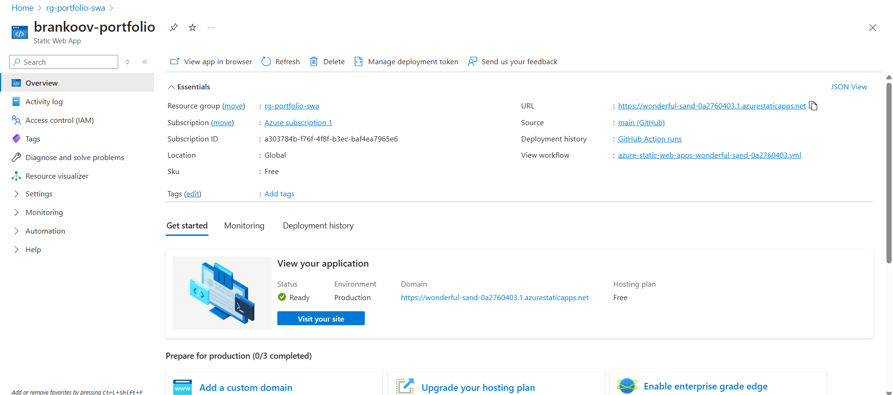
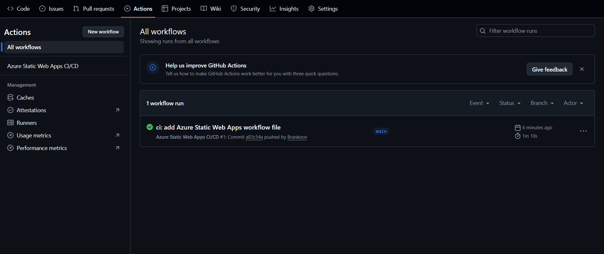
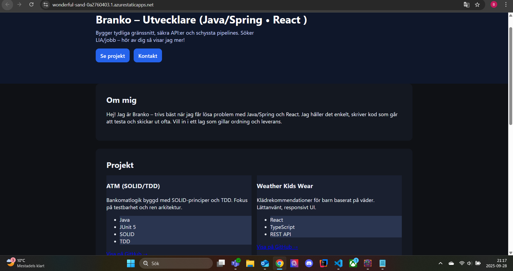

# Branko Portfolio

Personal developer portfolio built with **React (Vite + TypeScript)**. 
At first deployed with  **Azure Static Web Apps** via **GitHub Actions**.
Later changed to Vercel deployment.
> Cloud-hosted React portfolio with CI/CD on Azure/Vercel. Built for LIA/job applications.


## Live
- **URL:** https://branko-portfolio.vercel.app/

## Screenshots

**Azure Static Web Apps – Overview**  
[](docs/screenshots/swa-overview.png)

**GitHub Actions – successful deploy**  
[](docs/screenshots/actions-success.png)

**Live site**  
[](docs/screenshots/site-home.png)

## Features
- About, Projects with GitHub links, Tech stack, Contact
- Responsive layout, SPA routing

## Tech
- React + Vite + TypeScript
- Azure Static Web Apps (Free tier)
- CI/CD with GitHub Actions

## Deploy (TL;DR)
1. Push to `main`
2. Create Azure Static Web App (preset: React, output: `dist`)
3. Auto-deploy runs on each push

## SPA Fallback
Create `staticwebapp.config.json` in the project root:
```json
{
  "routes": [{ "route": "/*", "serve": "/index.html", "statusCode": 200 }]
}
```
